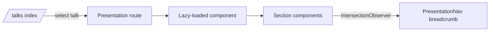

# roxabi-talks

**Presentation slides for Roxabi tech talks — built as a standalone TanStack Start app, deployed on Vercel.**

[](https://github.com/Roxabi/roxabi-talks)
[](https://www.typescriptlang.org/)

## Why

Talk slides built in presentation tools (Keynote, PowerPoint, Google Slides) are hard to version, share as code, or embed live demos in. This repo treats each talk as a React app — slides are components, navigation is routing, and the whole thing deploys automatically on every push to `main`.

For Roxabi's engineering talks — where the content is code, agents, and dev tooling — building the presentations in the same stack we talk about is intentional.

## Quick Start

```bash
# 1. Install dependencies
bun install

# 2. Start dev server
bun run dev
```

Open [http://localhost:3000](http://localhost:3000) — you'll land on the talks index.

Keyboard navigation inside a talk: `→` / `←` to move between sections, `Esc` to return to the index.

## How it works

Each talk lives under `apps/web/src/routes/talks/` as a pair of files:

- `<talk>.tsx` — route definition
- `<talk>.lazy.tsx` — lazy-loaded presentation component with section components

Sections are full-viewport panels rendered in a single scrollable container. A `useSectionTracking` hook keeps the URL-synced breadcrumb in sync with the visible section via `IntersectionObserver`.



Shared UI lives in `packages/ui` (built before the app). i18n is handled by [Paraglide](https://inlang.com/m/gerre34r/library-inlang-paraglideJs).

## Talks

| Slug | Title |
|------|-------|
| `claude-code` | Building with Claude Code — agents, toolchains, dev process |
| `lyra-dev` | Lyra: AI agent development deep-dive |
| `lyra-product` | Lyra: product story |
| `lyra-story` | Lyra: origin story |
| `dev-process` | Dev process with AI agents |

## Project Structure

```
apps/
  web/              # TanStack Start app
    src/
      routes/talks/ # One route per talk
      components/
        presentation/ # Section components (shared across talks)
packages/
  ui/               # Shared UI components (@repo/ui)
  config/           # Shared TypeScript/Biome config
```

## Development

| Command | Action |
|---------|--------|
| `bun run dev` | Start dev server |
| `bun run build` | Build for production |
| `bun run typecheck` | Type-check |
| `bun run lint` | Lint with Biome |
| `bun run format` | Format with Biome |

**Deploy:** pushes to `main` trigger a Vercel deployment automatically (`vercel.json`).

## Contributing

Open a PR against `staging`. See the commit format in `CLAUDE.md` (Conventional Commits).
Run `bun run typecheck && bun run lint` before pushing.

## License

Private repository — Roxabi internal use.
